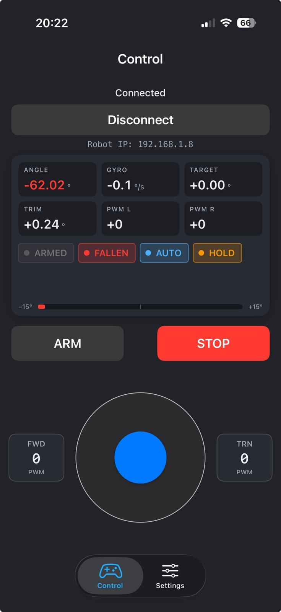

# BalanceRobotQT-Raspberry

A two-wheel self-balancing robot built with Raspberry Pi 5, Qt/C++, and an iOS BLE remote. The robot uses an MPU6050 IMU for pitch sensing and quadrature wheel encoders for position hold.

Demo: https://www.youtube.com/watch?v=immSrXEHzQE

Motor driver: Waveshare RPi Motor Driver Board — https://www.waveshare.com/wiki/RPi_Motor_Driver_Board

---

## How the control works

Three control layers run together at 200 Hz:

1. **Pitch PID** — keeps the robot upright. Inputs: filtered angle, gyro rate. Output: motor PWM.
2. **Speed tilt** — converts joystick command into a target pitch angle. Forward stick → robot leans forward → naturally accelerates. The tilt **fades as wheel speed rises**, so the joystick controls a target *speed*, not endless acceleration.
3. **Position hold** — when the joystick is released and the chassis has slowed below ~25 cm/s, encoders lock the current position. If the robot drifts or gets bumped, a small extra tilt nudges it back to the lock point.

---

## PID tuning guide

The pitch PID is the only loop you tune from the iOS app. Defaults (Kp=25, Ki=0.4, Kd=0.10) are a good starting point.

### Effect of each term

| Term | Increase it… | Decrease it… |
|------|--------------|--------------|
| **Kp** (proportional) | Stronger reaction to tilt. Robot feels stiff. Too high → oscillation, vibration, twitching at rest. | Robot feels soft, slow to react. Too low → robot leans further and falls before correcting. |
| **Ki** (integral) | Robot corrects steady-state lean (offset trim, slope). Too high → slow oscillation, "windup" overshoot after disturbance. | Robot may drift in one direction even when level. Too low → can't compensate for trim errors. |
| **Kd** (derivative) | Stronger damping. Reduces wobble after a push. Too high → motors buzz / chatter, sensor noise gets amplified into PWM. | Less damping. Robot oscillates after disturbances, takes longer to settle. |

### Symptom → which knob

| What you see | Try |
|--------------|-----|
| Robot leans the same way and slowly falls | Increase **Ki** by 0.05 |
| Robot wobbles back and forth at rest | Decrease **Kp** by 2-3, then check **Kd** |
| Motors buzz, robot vibrates audibly | Decrease **Kd** by 0.02 |
| Push it and it oscillates for many seconds | Increase **Kd** by 0.02-0.03 |
| Push it and it overshoots wildly | Decrease **Kp** by 2-3 |
| Robot keeps speeding up and falls forward | Lower joystick forward speed in app, or check wheel encoders are wired |

### Speed tilt and position hold

These are not in the UI — they live in the Pi source code (`robotcontrol.h`):

```
MAX_SPEED_TILT_DEG     = 2.0    // max forward lean from full joystick
POS_GAIN_DEG_PER_TICK  = 0.0015 // position-hold P term
POS_VEL_GAIN           = 0.09   // position-hold D term
POS_MAX_TILT_DEG       = 1.0    // pos hold can never tilt more than this
```

Don't change `POS_MAX_TILT_DEG > 1.5`. Position correction must stay weaker than pitch balance — otherwise the position loop fights the pitch loop and the robot falls.

---

## Encoder calibration

Wheel encoders are quadrature (signed counts). Direction sign per wheel is set in `settings.ini`:

```ini
encoderInvertL=true
encoderInvertR=true
```

If the robot tries to run *toward* a disturbance instead of away from it, flip one (or both) of these.

Calibration constant (measured): **~19 ticks/cm** (5.3 mm/tick).

---

## Setup

### One-time Pi setup

```bash
sudo apt update && sudo apt upgrade
sudo apt install qt5-default qtconnectivity5-dev qtmultimedia5-dev \
  libqt5multimedia5-plugins espeak-ng i2c-tools libi2c-dev \
  libbluetooth-dev bluetooth blueman bluez
```

Enable I2C and SPI:
```bash
sudo raspi-config       # Interface Options → I2C: Yes, SPI: Yes
sudo reboot
```

Install wiringPi (Pi 4/5):
```bash
sudo apt purge wiringpi
cd /tmp
wget https://project-downloads.drogon.net/wiringpi-latest.deb
sudo dpkg -i wiringpi-latest.deb
gpio -v
```

### Build

```bash
cd BalanceRobotPI
qmake
make
```

### Run

```bash
sudo ./BalanceRobotPI
```

Put the robot on a hard flat surface and **keep it still** until gyro calibration succeeds (you'll see `Gyro bias OK`). If calibration fails 3 times, the robot won't balance correctly — restart and hold it steady.

### Auto-start on boot

Create `/home/pi/start_robot.sh`:

```bash
#!/bin/bash
sudo chown root.root /home/pi/BalanceRobotPI/BalanceRobotPI
sudo chmod 4755 /home/pi/BalanceRobotPI/BalanceRobotPI
cd /home/pi/BalanceRobotPI
sudo ./BalanceRobotPI
```

```bash
chmod +x /home/pi/start_robot.sh
```

Create `/lib/systemd/system/balancerobot.service`:

```ini
[Unit]
Description=Balance Robot
After=multi-user.target

[Service]
Type=idle
ExecStart=/home/pi/start_robot.sh

[Install]
WantedBy=multi-user.target
```

```bash
sudo chmod 644 /lib/systemd/system/balancerobot.service
sudo systemctl daemon-reload
sudo systemctl enable balancerobot.service
sudo reboot
```

Check status:
```bash
sudo systemctl status balancerobot.service
```

---

## iOS remote

The Swift project (`BalanceRobotRemote_IOS/`) builds in Xcode. Two tabs:

- **Control** — joystick, ARM/STOP, connection.
- **Settings** — PID sliders (Kp/Ki/Kd), AC/SD, joystick speed limits, modes, Reset to defaults.

Reset to defaults sends Kp=25, Ki=0.4, Kd=0.10 — same as the Pi-side `settings.ini` defaults.

---

<p align="center">
  
</p>
